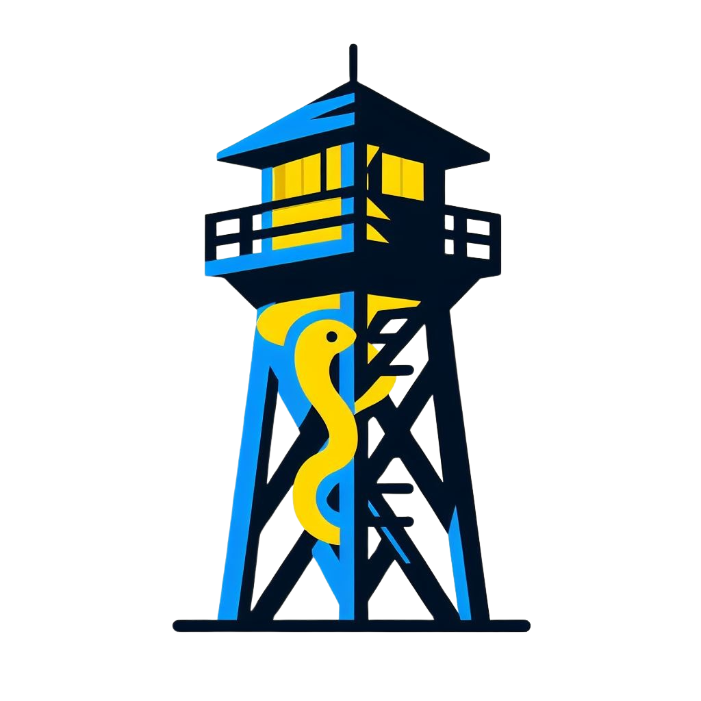

<a name="readme-header"></a>

<!---
=============================================================================
Watchtower
=============================================================================
README
-----------------------------------------------------------------------------
Summary of the project, including its purpose and how to use it.

:Authors: Fabio Craig Wimmer Florey <fabioflorey@icloud.com>
:Version: 0.0.1
:License: MIT-0
--->


<div align="center">
  </img>
  <h1>Watchtower</h1>
  <h4>Watchtower monitors changes on webpages</h4>
</div>

---

## Table of Contents
+ [About](#about)
  * [Goals](#goals)
  * [Contribution](#contribution)
+ [Quick Start](#quick-start)
  * [Prerequisites](#prerequisites)
  * [Installation](#installation)
    - [From source](#install-the-latest-version-of-the-project-from-source)
+ [Usage](#usage)
  * [Features](#features)
+ [Security](#security)
+ [License](#license)
+ [Miscellaneous](#miscellaneous)
  * [Additional Documentation](#additional-documentation)
  * [Resources and External Links](#resources-and-external-links)
  * [References](#references)


## About
Sometimes, certain RPA bot operations can break due to inactive websites, changed HTML, or altered page aesthetics (especially those using OCR). This script aims to monitor these changes to enhance proactivity in response to the described issues.

*Check the [glossary][GLOSSARY] section of the repository.*

<p align="right"><a href="#readme-header">⮨</a></p>

### Goals
The goal is to monitor the status, layout, and HTML of a list of websites to be proactive in case of breaking changes in RPA bots.

<p align="right"><a href="#readme-header">⮨</a></p>

### Contribution
*If you want to contribute to the code, please read the [CONTRIBUTING][CONTRIBUTING] section.*
- Check if an issue is already open with the [issue tracker][ISSUE TRACKER] or submit a new [issue][ISSUE].

<p align="right"><a href="#readme-header">⮨</a></p>

## Quick Start
### Prerequisites
To check that the prerequisites are met, review this check-list:

- [x] **Chrome WebDriver**
- [x] **Python 3.9 or upper**

You can find the list of each module needed by the software within the [requirements][REQUIREMENTS] file.

### Installation
#### Install the `latest` version of the project from source
  1. [Fork][FORK] this repository;
  1. Run the following commands:
      ```matlab
      python setup.py check
      python setup.py build
      python setup.py install
      ```
<p align="right"><a href="#readme-header">⮨</a></p>

## Usage

### Features
- [x] **Website Status Recognition**

  `Watchtower` monitors each each website status code and status message.

- [x] **Graphical Change Recognition**

  `Watchtower` monitors each each website appereance by a crop resistant checksum of a website snap.
  
- [x] **HTML Structure Recognition**

   `Watchtower` monitors each each website HTML code, besides hred and values.

<p align="right"><a href="#readme-header">⮨</a></p>

## Security
Please see our [Security Policy][SECURITY] for reporting vulnerabilities.

<p align="right"><a href="#readme-header">⮨</a></p>

## License
This project is licensed under the **MIT** license. See [LICENSE][LICENSE] for more information.

<div align="center"><pre align="center" lang="json">
Watchtower, Copyright © 2022, Fabio Craig Wimmer Florey - All Rights Reserved.
Unless required by applicable law or agreed to in writing, software
distributed under the License is distributed on an "AS IS" BASIS,
WITHOUT WARRANTIES OR CONDITIONS OF ANY KIND, either express or implied.
See the License for the specific language governing permissions
and limitations under the License.
</pre></div>
<p align="right"><a href="#readme-header">⮨</a></p>
<!---
## Miscellaneous
### Additional Documentation
### Resources and External Links
### References
Documentation, external links, resources and references.
- Document Example [^1]
<p align="right"><a href="#readme-header">⮨</a></p>
--->

<!------------------------------------  Hyperlinks ----------------------------------------->
[FORK]: ../../fork
[CONTRIBUTING]: /docs/community/CONTRIBUTING.md
[DISCUSSION]: ../../discussion
[GLOSSARY]: docs/community/GLOSSARY.md
[ISSUE]: ../../issues/new
[ISSUE TRACKER]: ../../issues
[LICENSE]: /LICENSE.md
[PULL]: ../../compare
[REQUIREMENTS]: /requirements.txt
[SECURITY]: /.github/SECURITY.md

<!------------------------------------  References --------------------------------------->
[^1]: https://example.org |  “quote” | `code` | [book](https://example.org)
